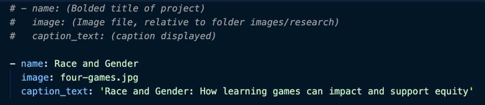
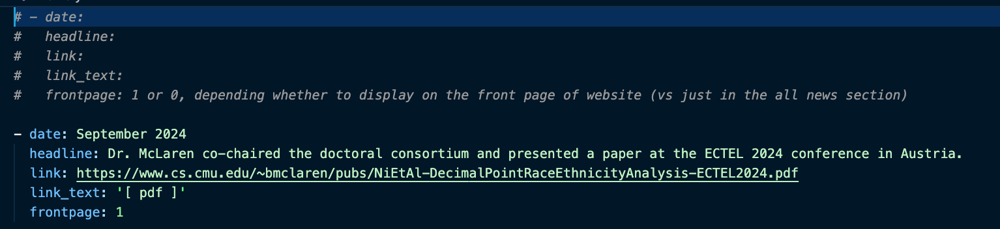
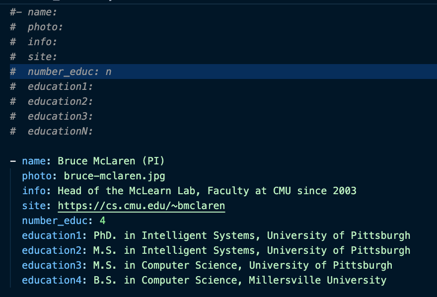
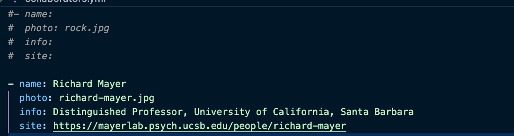
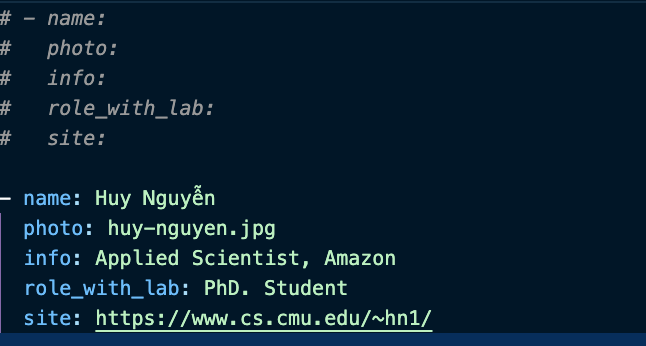
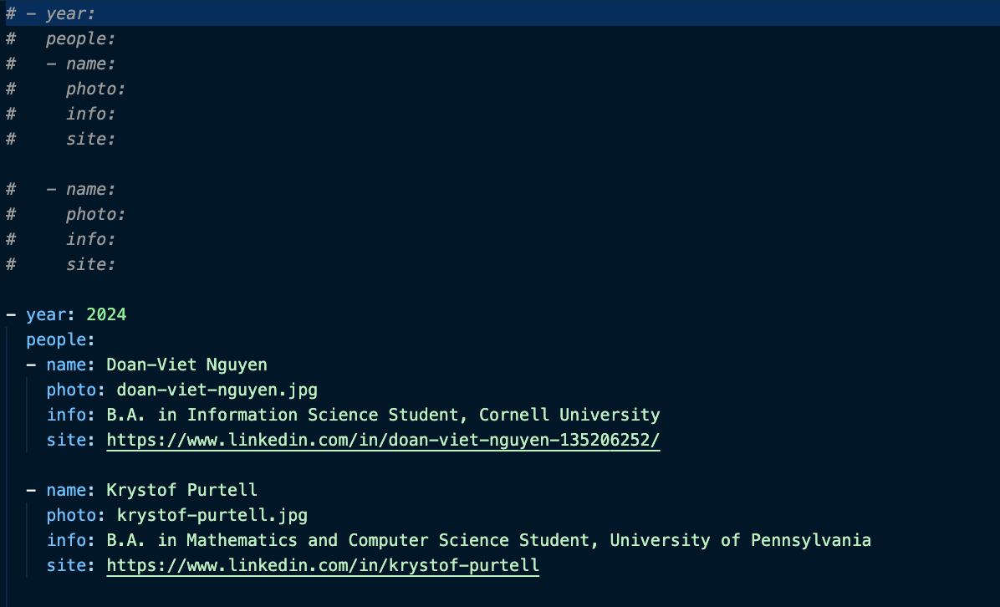
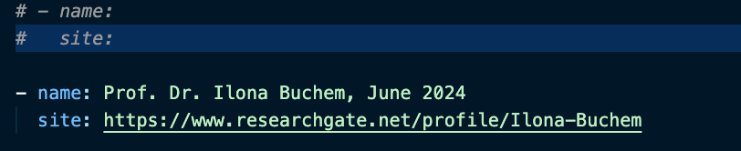
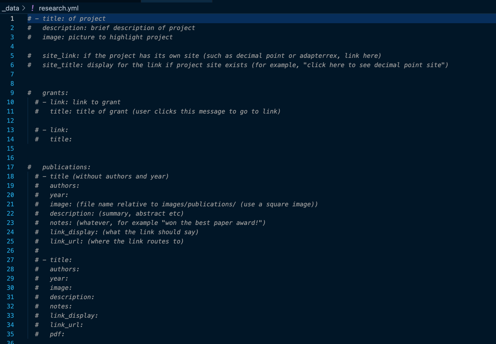

# McLearn Lab website

This is the website of our academic research group at CMU
https://www.cs.cmu.edu/~bmclaren/mclearnlab/

We used the Allan Lab template to make this.
https://www.allanlab.org/aboutwebsite.html

# Editing instructions

# 1: Install Dependencies
1) <a href="https://git-scm.com/downloads"> Git</a> and a Github account for checking out these files and uploading your changes.
2) <a href="https://www.ruby-lang.org/en/downloads/"> Ruby version 2.5 or later </a>, the language the engine uses. (You don't need to know the language just have it installed)
3) <a href="https://jekyllrb.com/">Jekyll</a> the Ruby library used that allows for easy-to-use interfacing for static sites. I recommend installing this after you've cloned the repository to your machine (step 2). 

# 2: Clone repository 
You will need to clone this repository onto your machine. 
https://docs.github.com/en/repositories/creating-and-managing-repositories/cloning-a-repository

# 3: Launch development server 
To launch the development server, run 
`jekyll serve` 

click the link in terminal to pull up a development version of the site.

# 4: Edit
To edit the different parts of the website, you will need to change the corresponding configurations in _data. Once you have the development server up and running from step 3, then you can just refresh your test build to see these changes. These tutorials will explain how to add new entries, but you can edit existing information on the site by editing the existing entries in the files specified. 

## Home page 

### HOME PAGE CAROUSEL: 

In `_data/carousel.yml`, add a new entry following this pattern.

Add your desired image with the title you specified in the yml to the folder `images/homepageslider/`. 

By default, this image will on-click route to a corresponding entry in the research page. If you don't have a corresponding entry in the research page, then clicking the picture will lead to a "page not found" page. An interested developer may add a field to carousel entries to dictate whether or not they have a link, in case they want a carousel picture without a matching research entry. The `name` field must match the `title` field of a research project to successfully link to that entry.

### NEWS:
Add an entry in `_data/news.yml` following this pattern. 

`frontpage` should be 1 if you want it on the main page, or 0 if you only want it visible upon clicking "see all news".

## Team Page

### GROUP MEMBERS: 
In `_data/team_members.yml`, add a new entry following this pattern. 

Add your corresponding photo to `images/team/`. 
`number_educ` should match the amount of education bullet points you have listed. 

### ASSOCIATED MEMBERS:
Follow the same instructions as for group members, but edit `_data/associated_members.yml` instead. Your photo will still go in `images/team/`. 

### KEY COLLABORATORS:
Add an entry to `_data/collaborators.yml`, following this pattern.

Add your corresponding photo to `images/team/`.

### FORMER MEMBERS:
Add an entry to `_data/former_members.yml`, following this pattern.

Add your corresponding photo to `images/team/`.

### FORMER REU PROGRAM INTERNS:
Add an entry to `_data/former_interns.yml`, following this pattern.

Add your corresponding photo to `images/team/`.
<b>Make sure you follow proper yml nesting syntax, adding the individual interns into the `people` field of the given year.</b> 

### FORMER VISITORS:
Add an entry to `data_former_visitors.yml` following this pattern.

### ADMINISTRATIVE SUPPORT:
To edit the administrative support info, you can find that at the bottom of `_pages/team.md`.

## Research Page

### RESEARCH PROJECTS: 

To add an entirely new research project, in `_data/research.yml`, add a new entry following this pattern.

Add your desired image for the project with the title you specified in the yml to the folder `images/research/`. 

If you want an image in the home page carousel that links to the project, make sure the `title` field of the research project matches the `name` field of the carousel entry. 

<b>Note that the grants and publications entries are nested inside of the research projects in `research.yml`. To edit the following, make sure to use proper yml nesting syntax, including indentation and hyphens where needed. </b>

#### GRANTS: 
Add a title and link to the nested `grants` field of your desired research project, following the pattern in the previous screenshot. 

#### PUBLICATIONS: 

Add an entry to the nested `publications` field of your desired research project, following the pattern in the previous screenshot. 
Add your picture for the publication to `images/publications`. 

# 5: Package for deployment
Once you are happy with your changes, you can't send it to the server just yet because it is configured with your machine as the server.
Before sending the site into the server, you need to package it by running
`jekyll build`
This packages a static site nicely into the folder `_site`, with Bruce's server space configured as the server.

# 6: Deploy
First, you will need to make sure you have read/write access to the directory space in cs.cmu.edu for the site. Talk to Bruce about this, he has to request from IT. 

To deploy, (if you are not Bruce McLaren), run 
`scp -r _site/* YOUR_USER@linux.gp.cs.cmu.edu:../bmclaren/www/mclearnlab`

If you are Bruce, it is 
`scp -r _site/* YOUR_USER@linux.gp.cs.cmu.edu:/www/mclearnlab`

When prompted, enter your password

This command securely copies (scp) recursively (-r) packaged site (_site/*) to the mcLearnlab directory in Bruce's cs.cmu space (YOUR_USER@linux.gp.cs.cmu.edu:../bmclaren/www/mclearnlab)

# 7 update github
Make sure to keep github up to date in case anyone else goes to edit the site. 